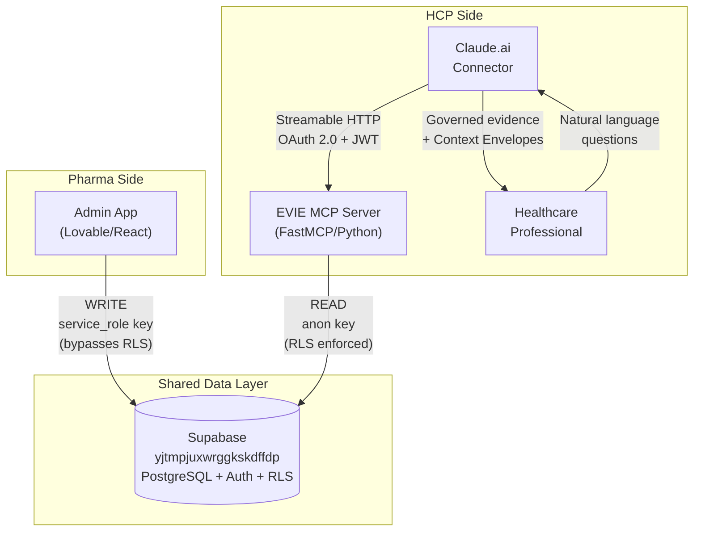
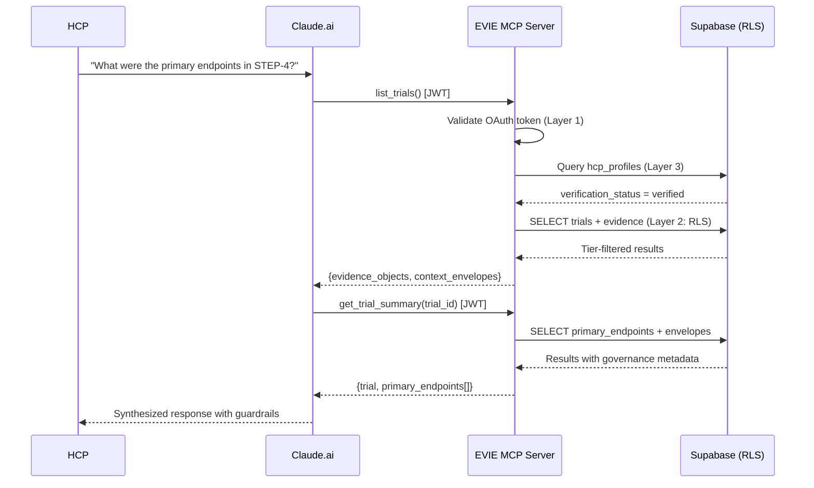
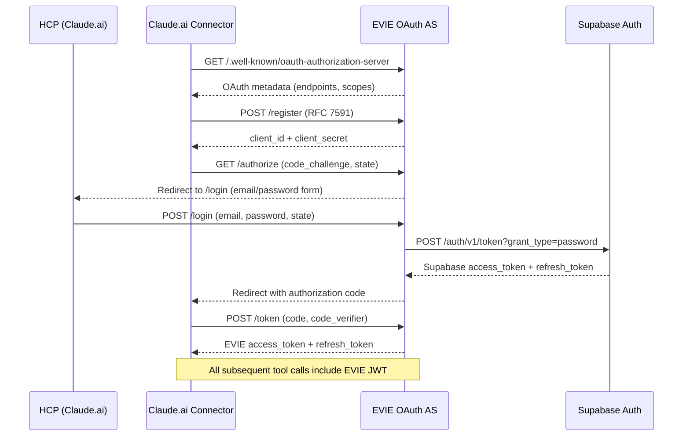
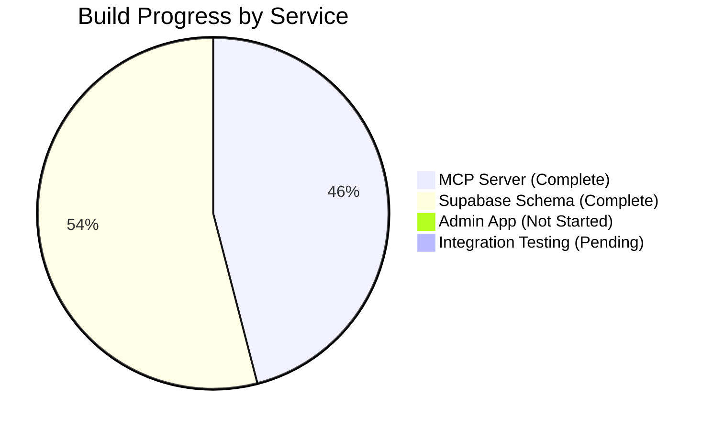
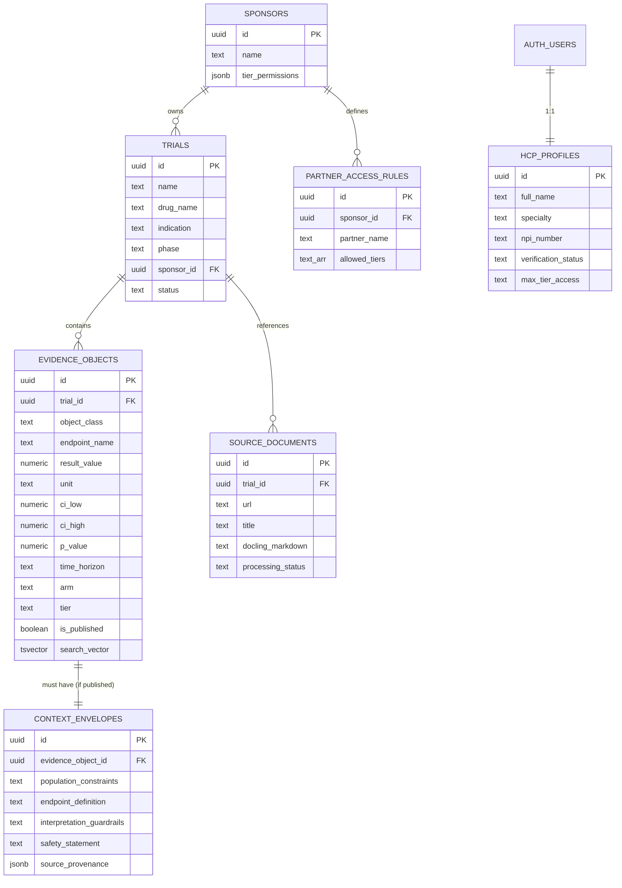
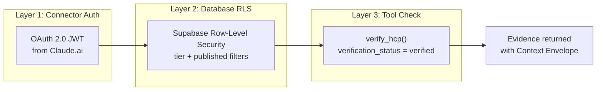
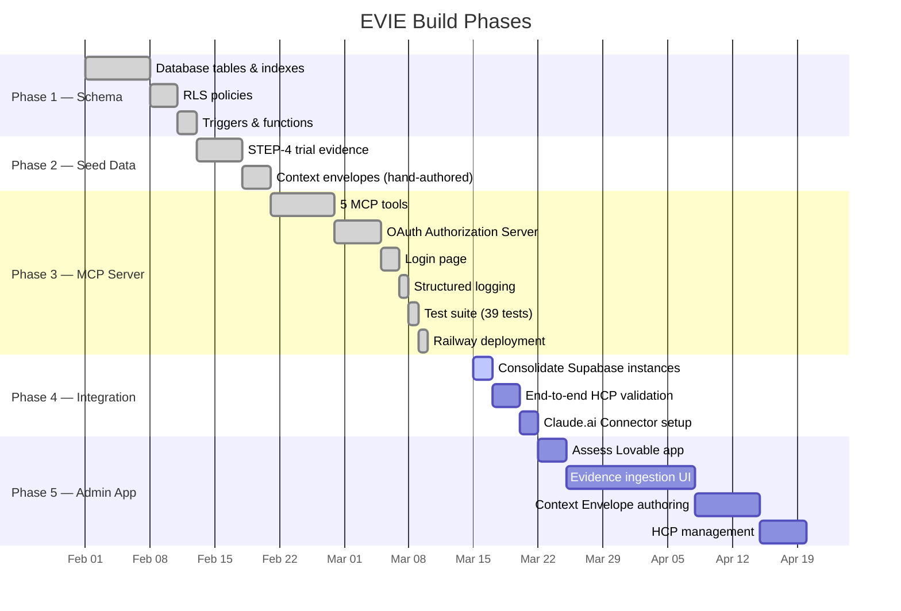

# EVIE — Product Requirements & System Architecture

> Evidence Intelligence & Context Infrastructure
> Version 2.0 · March 2026

---

## 1. Product Vision

EVIE is a two-sided clinical evidence platform that connects **pharmaceutical Medical Affairs teams** (who structure and govern clinical trial data) with **verified healthcare professionals** (who query that data through Claude.ai).

The platform ensures that every piece of clinical evidence is delivered with mandatory governance metadata — population constraints, interpretation guardrails, and safety statements — so that AI-synthesized responses are grounded in context-safe, provenance-tracked data.

### Core Users

| User | Role | Interface |
|------|------|-----------|
| **Pharma Medical Affairs** | Ingest PDFs, structure evidence, assign governance rules | Admin App (web) |
| **Healthcare Professionals (HCPs)** | Query clinical evidence via natural language | Claude.ai Connector |

### Key Differentiator

EVIE does not generate medical advice. It retrieves and structures evidence. Claude synthesizes responses. The **Context Envelope** — attached to every evidence result — ensures Claude always has the guardrails needed to present evidence responsibly.

---

## 2. System Architecture

### 2.1 Service Map



### 2.2 Data Flow



### 2.3 Authentication Flow



---

## 3. Service Status

### 3.1 Overall Status



### 3.2 Service-by-Service Status

#### Supabase Data Layer — `yjtmpjuxwrggkskdffdp`

| Component | Status | Notes |
|-----------|--------|-------|
| Schema (7 tables) | DONE | `trials`, `evidence_objects`, `context_envelopes`, `hcp_profiles`, `sponsors`, `partner_access_rules`, `source_documents` |
| Row-Level Security | DONE | Tier-based filtering, published-only, own-profile-only |
| Full-text search index | DONE | GIN index on `search_vector` (generated tsvector) |
| Triggers | DONE | Envelope-before-publish guard, auto `updated_at` |
| Tier ranking function | DONE | `tier_rank()` for RLS comparisons |
| Seed data (STEP-4) | DONE | 1 sponsor, 1 trial, 7 evidence objects, 7 context envelopes |
| Consolidation | PENDING | MCP Server must be repointed from `zjyuewcgdllfgpdgvfmk` to `yjtmpjuxwrggkskdffdp` (env var change in Railway) |

#### EVIE MCP Server — Railway

| Component | Status | Notes |
|-----------|--------|-------|
| 5 MCP tools | DONE | `list_trials`, `get_trial_summary`, `get_evidence`, `get_evidence_detail`, `get_safety_data` |
| Context Envelope guarantee | DONE | No evidence returned without governance metadata |
| OAuth 2.0 Authorization Server | DONE | Wraps Supabase Auth, RFC 8414 compliant |
| Email/password login page | DONE | Dark-themed form, handles auth + redirect |
| 3-layer authentication | DONE | Connector OAuth + Supabase RLS + tool-level HCP verification |
| Health check (`/health`) | DONE | Returns `{"status": "ok", "server": "evie_mcp"}` |
| MCP server card (`/.well-known/mcp.json`) | DONE | Tool discovery for Claude.ai Connector |
| Structured JSON logging | DONE | Audit trail for all tool calls with user_id, query, duration |
| Auth event logging | DONE | Success/failure events for compliance |
| Test suite | DONE | 39 tests (models, DB converters, OAuth, auth) |
| Dockerfile + Railway config | DONE | Python 3.11-slim, healthcheck, auto-restart |
| Token persistence | NOT STARTED | In-memory only; acceptable for single-instance Phase 1 |
| Rate limiting | NOT STARTED | No abuse protection yet |
| End-to-end validation | PENDING | Needs Supabase consolidation first |

#### Admin App (Lovable) — `/evie`

| Component | Status | Notes |
|-----------|--------|-------|
| Project setup | UNKNOWN | Lovable web app exists but not assessed in this session |
| Evidence ingestion UI | UNKNOWN | Needs assessment |
| Context Envelope authoring | UNKNOWN | Needs assessment |
| Supabase integration | PARTIAL | Uses `yjtmpjuxwrggkskdffdp` (confirmed) |
| HCP management | UNKNOWN | Needs assessment |

---

## 4. Database Schema

### 4.1 Entity Relationship



### 4.2 Key Constraints

| Rule | Enforcement |
|------|-------------|
| Evidence cannot be published without a Context Envelope | Database trigger (`check_envelope_before_publish`) |
| HCPs only see evidence at or below their tier | RLS policy on `evidence_objects` using `tier_rank()` |
| HCPs only see published evidence | RLS policy: `is_published = true` |
| HCPs can only read their own profile | RLS policy: `id = auth.uid()` |
| Source documents never exposed to HCPs | RLS policy: `USING (false)` |
| `interpretation_guardrails` and `safety_statement` are mandatory | `NOT NULL` constraints on `context_envelopes` |

---

## 5. MCP Tool Specifications

### 5.1 Tool Overview

| Tool | Input | Output | Latency Target |
|------|-------|--------|----------------|
| `list_trials()` | None | JSON array of accessible trials | < 500ms |
| `get_trial_summary(trial_id)` | UUID | Trial metadata + primary endpoint evidence + envelopes | < 1s |
| `get_evidence(query, trial_id?, object_class?)` | String + optional filters | Array of `{evidence_object, context_envelope}` pairs | < 2s |
| `get_evidence_detail(evidence_object_id)` | UUID | Full evidence object + full context envelope | < 500ms |
| `get_safety_data(trial_id)` | UUID | Adverse event objects sorted by incidence, with safety statements | < 1s |

### 5.2 Response Contract

Every tool returning evidence follows this structure — no exceptions:

```json
{
  "evidence_object": {
    "id": "uuid",
    "trial_id": "uuid",
    "object_class": "primary_endpoint",
    "endpoint_name": "Body weight change from baseline",
    "result_value": -12.6,
    "unit": "%",
    "confidence_interval": [-13.1, -12.1],
    "p_value": 0.0001,
    "time_horizon": "68 weeks",
    "arm": "Semaglutide 2.4mg",
    "tier": "tier1"
  },
  "context_envelope": {
    "population_constraints": "Adults with BMI >= 30...",
    "endpoint_definition": "Percentage change in body weight...",
    "interpretation_guardrails": "Results apply to mITT population...",
    "safety_statement": "Common adverse events include nausea...",
    "source_provenance": {
      "trial_name": "STEP-4",
      "doi": "10.1001/jama.2021.23619"
    }
  }
}
```

---

## 6. Security & Governance

### 6.1 Three-Layer Authentication



### 6.2 Tier Access Model

| Tier | Access Level | Example Content |
|------|-------------|-----------------|
| `tier1` | Basic | Primary endpoints, top-line AE data |
| `tier2` | Extended | Subgroup analyses |
| `tier3` | Advanced | Comparator details, methodology |
| `tier4` | Full | All evidence including exploratory |

HCPs default to `tier1`. Tier elevation requires admin action.

### 6.3 Audit Trail

Every tool call is logged as structured JSON:

```json
{
  "timestamp": "2026-03-15T10:30:00Z",
  "level": "INFO",
  "logger": "evie.audit",
  "event": "tool_call",
  "tool": "get_evidence",
  "user_id": "abc-123",
  "query": "weight loss in patients with BMI > 35",
  "result_count": 3,
  "duration_ms": 142
}
```

---

## 7. Tech Stack

| Layer | Technology | Notes |
|-------|------------|-------|
| **MCP Server** | FastMCP >= 3.1.0 | Python MCP framework with built-in OAuth |
| **Language** | Python 3.11 | Async, type-hinted |
| **Database** | Supabase (PostgreSQL 15) | Project `yjtmpjuxwrggkskdffdp` |
| **Auth** | Supabase Auth + custom OAuth AS | EVIE wraps Supabase behind RFC 8414 |
| **Admin App** | Lovable (React) | Pharma-facing web UI |
| **MCP Hosting** | Railway | Dockerfile, healthcheck, auto-restart |
| **Transport** | Streamable HTTP | Required by Claude.ai Connector |
| **Logging** | Python stdlib (JSON formatter) | Structured audit trail |
| **Testing** | pytest + pytest-asyncio | 39 tests |

---

## 8. Infrastructure

### 8.1 Supabase — Consolidated

| Setting | Value |
|---------|-------|
| **Active Project** | `yjtmpjuxwrggkskdffdp` |
| **URL** | `https://yjtmpjuxwrggkskdffdp.supabase.co` |
| **Decommissioned** | `zjyuewcgdllfgpdgvfmk` (to be deleted after migration) |
| **Admin App access** | Service role key (bypasses RLS for writes) |
| **MCP Server access** | Anon key (RLS enforced for HCP reads) |

### 8.2 Railway — MCP Server

| Setting | Value |
|---------|-------|
| **Build** | Dockerfile (Python 3.11-slim) |
| **Start command** | `python -m src.evie.server` |
| **Health check** | `GET /health` (60s timeout) |
| **Restart policy** | On failure |
| **Required env vars** | `SUPABASE_URL`, `SUPABASE_ANON_KEY` |
| **Optional env vars** | `EVIE_BASE_URL`, `PORT`, `HOST` |

---

## 9. Build Phases & Current Progress



| Phase | Status | Deliverables |
|-------|--------|-------------|
| **1 — Schema** | DONE | 7 tables, RLS, triggers, FTS index, `tier_rank()` |
| **2 — Seed Data** | DONE | STEP-4 trial: 7 evidence objects + 7 context envelopes |
| **3 — MCP Server** | DONE | 5 tools, OAuth AS, login page, logging, 39 tests, Railway config |
| **4 — Integration** | IN PROGRESS | Consolidate Supabase to `yjtmpjuxwrggkskdffdp`, validate end-to-end |
| **5 — Admin App** | NOT STARTED | Assess existing Lovable app, build evidence ingestion |

---

## 10. Immediate Next Steps

1. **Complete Supabase consolidation** — Point MCP Server at `yjtmpjuxwrggkskdffdp`, verify schema exists, decommission `zjyuewcgdllfgpdgvfmk`
2. **End-to-end HCP test** — Create test HCP in Supabase Auth, verify Connector flow, confirm evidence retrieval
3. **Assess Admin App** — Review `/evie` Lovable project, catalog what exists, identify gaps
4. **Plan Admin App integration** — Design evidence ingestion UI that writes to the shared Supabase

---

## 11. Non-Goals

EVIE explicitly does **not**:

- Process PDFs or run ML models (the MCP Server is a thin query layer)
- Generate clinical summaries — Claude does that using governed evidence
- Make regulatory claims or interpret label status
- Generate medical advice or clinical recommendations
- Cache or store evidence outside Supabase
- Serve the Admin App — that connects to Supabase directly

---

## 12. Success Metrics

| Metric | Target |
|--------|--------|
| Evidence retrieval latency | < 2 seconds for `get_evidence` |
| Context Envelope attachment rate | **100%** — no evidence without envelope |
| HCP Connector activation time | < 5 minutes from account creation to first query |
| Governance failure rate | **0%** — no evidence above HCP's permitted tier |
| Test coverage | All core modules covered (models, DB, OAuth, auth) |
| Audit trail completeness | Every tool call logged with user_id, query, timestamp |

---

## 13. Repository Structure

```
evie-mcp-server/
├── src/evie/
│   ├── server.py          # FastMCP server, routes, entry point
│   ├── tools.py           # 5 MCP tool definitions + audit logging
│   ├── db.py              # Supabase client and query helpers
│   ├── oauth.py           # OAuth AS wrapping Supabase Auth
│   ├── auth.py            # HCP verification (Layer 3)
│   ├── models.py          # Pydantic models
│   ├── logging.py         # Structured JSON logging
│   └── _state.py          # Shared state
├── tests/
│   ├── conftest.py        # Shared fixtures
│   ├── test_models.py     # Model and tier logic tests
│   ├── test_db.py         # DB converter tests
│   ├── test_oauth.py      # OAuth lifecycle tests
│   └── test_auth.py       # Auth verification tests
├── migrations/
│   ├── 001_schema.sql     # Tables, indexes, triggers
│   ├── 002_rls.sql        # Row-Level Security policies
│   └── 003_seed_step4.sql # STEP-4 seed data
├── docs/
│   ├── architecture.md    # MCP Server architecture (detailed)
│   └── prd-system-architecture.md  # This document
├── Dockerfile
├── railway.toml
├── requirements.txt
├── requirements-dev.txt
├── .env.example
└── README.md
```
